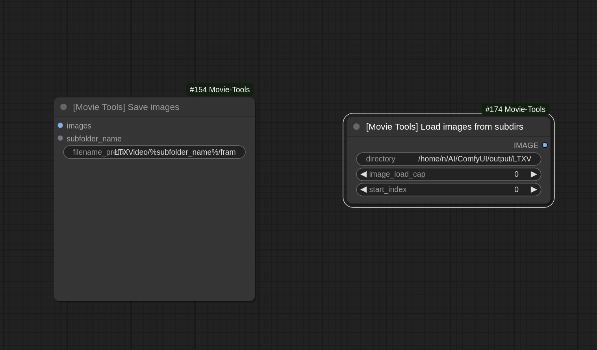

# Movie Tools for ComfyUI [Work in progress]

**Movie Tools** is a set of custom nodes for [ComfyUI](https://github.com/comfyanonymous/ComfyUI), designed to simplify saving and loading batches of images with enhanced functionality like subfolder management, metadata embedding, and batch image handling.




## Features

- **Save Images to Subfolders**  
  Save generated images to structured subfolders with customizable filenames and metadata embedding. PNG writes are parallelized across CPU cores.

- **Load Images from Subdirectories**  
  Load images in batches from nested directories, with options to limit the number of images and specify a starting index. Decoding is parallelized and batching avoids the O(n²) concat cost of naive implementations.

- **Load Images and Create Video**  
  Stream an image sequence (with optional audio) directly into an encoded video file. Frames are decoded on a bounded thread pool and piped straight into ffmpeg, so the whole sequence is never held in memory at once — sequences of thousands of frames encode in seconds instead of hours and won't OOM.

---

## Node Descriptions

### 1. **SaveImagesWithSubfolder**
This node saves input images to a specified output directory, organizing them into subfolders and embedding metadata such as prompts and extra information.

#### **Input Parameters**
- `images`: Images to save.  
- `filename_prefix`: Prefix for saved files. Can include formatting like `%date:yyyy-MM-dd%`.  
- `subfolder_name`: Name of the subfolder to create within the output directory.  
- `compress_level`: (Optional) PNG compression level (0-9, default 4). Lower is faster with larger files — use 0-1 for large batches.
- `prompt`: (Hidden) Prompt text for metadata embedding.  
- `extra_pnginfo`: (Hidden) Additional metadata to include in the saved PNG files.

#### **Output**
- Saves images to the specified location and returns metadata about the saved images.

---

### 2. **LoadImagesFromSubdirsBatch**
This node loads images from a directory and its subdirectories into a batch tensor, ensuring the images have consistent dimensions.

#### **Input Parameters**
- `directory`: Path to the directory containing images.  
- `image_load_cap`: (Optional) Limit on the number of images to load.  
- `start_index`: (Optional) Index from which to start loading images.

#### **Output**
- Returns a batch of loaded images as a tensor.

> For long sequences (hundreds+ of frames), prefer **LoadImagesAndCreateVideo** below — returning everything as one tensor batch keeps the whole sequence in RAM/VRAM at once and can OOM.

---

### 3. **LoadImagesAndCreateVideo**
Loads an image sequence from a directory and encodes it directly to an MP4 (via ffmpeg), optionally muxing in audio, without ever materializing the full sequence as a tensor batch. Frames are decoded on a bounded worker pool and streamed straight to ffmpeg's stdin, so memory use stays constant regardless of sequence length.

#### **Input Parameters**
- `directory`: Folder with the image sequence, picked from a dropdown of subfolders inside the ComfyUI output directory (recurses into subdirectories). An absolute path still works if entered via the API.
- `frame_rate`: Output video frame rate.
- `filename`: Output file name in the ComfyUI output directory (may include a subfolder, e.g. `my_folder/video`; `.mp4` is appended if missing, existing files are overwritten).
- `audio`: (Optional) `AUDIO` input (e.g. from a `LoadAudio` node). Padded with silence or trimmed to match the video length.
- `image_load_cap` / `start_index`: (Optional) Limit/offset into the sequence.
- `max_side`: (Optional) Downscale so the longest side doesn't exceed this many pixels — speeds up encoding for large source images.
- `crf`: x264 quality (lower = higher quality/larger file, default 19).
- `preset`: x264 speed/efficiency tradeoff (default `veryfast`).
- `num_workers`: Parallel decode threads (0 = auto).

The video is saved to the ComfyUI output directory and an inline preview is shown in the UI.

Requires `ffmpeg` to be available on `PATH` (or `imageio-ffmpeg` installed as a fallback).

---

## Installation

This Node is designed for use within ComfyUI. Ensure ComfyUI is installed and operational in your environment. 

 - Copy the `ComfyUI-Movie-Tools` folder into the `custom_nodes` directory accessible by your ComfyUI project.

1. Clone the repository:
   ```bash
   git clone https://github.com/yourusername/movie-tools-comfyui.git
   ```
2. Navigate to the directory:
   ```bash
   cd movie-tools-comfyui
   ```
3. Install dependencies (if any):
   ```bash
   pip install -r requirements.txt
   ```

---

## Requirements

- Python 3.8+
- Torch
- NumPy
- Pillow (PIL)

---

## License

This project is licensed under the MIT License. See the `LICENSE` file for more details.

---

## Contributions

Contributions are welcome! Feel free to open an issue or submit a pull request.
